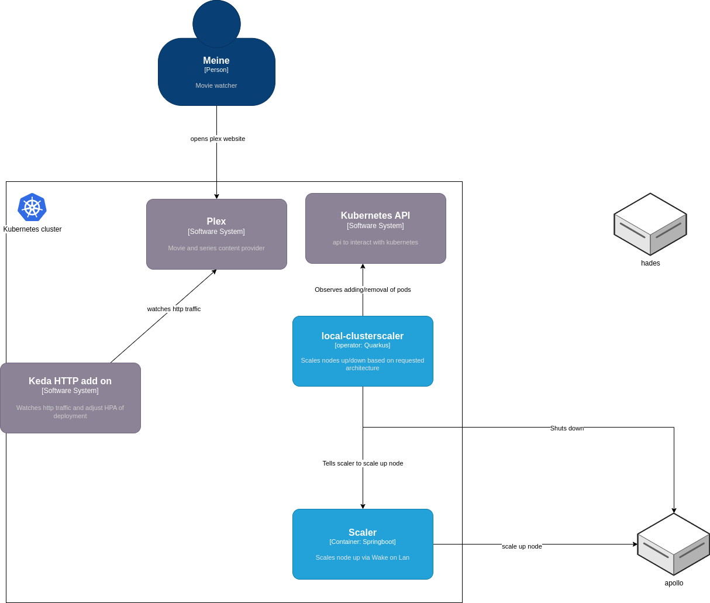

# Overview


# Install platform thingies

## On odroid
install k3s

```
helm install keda kedacore/keda --namespace keda --values values.yaml
```


### Run scaler 
In scaler folder in this repo:
```
mvn clean install
```
Copy jar file to hades: /home/meine/scaler/scaler.jar.
Create systemd unit in /etc/systemd/system/scaler/service:

```shell
  GNU nano 6.2                                                                                                                                         scaler.service                                                                                                                                                  
[Unit]
Description=Scaling service
After=syslog.target network.target

[Service]
SuccessExitStatus=143

User=meine
Group=meine

Type=simple

WorkingDirectory=/home/meine/scaler
ExecStart=/home/meine/.sdkman/candidates/java/current/bin/java -jar scaler.jar
ExecStop=/bin/kill -15 $MAINPID

[Install]
WantedBy=multi-user.target

```

Enable/run with:
```shell
sudo systemctl daemon-reload
sudo systemctl start scaler.service
```
## On P52
Install k3s

### Add p52 as workernode


```
curl -sfL https://get.k3s.io | K3S_URL=https://myserver:6443 K3S_TOKEN=mynodetoken sh -
```

Setting the K3S_URL parameter causes the installer to configure K3s as an agent, instead of a server. The K3s agent will register with the K3s server listening at the supplied URL. 
The value to use for K3S_TOKEN is stored at /var/lib/rancher/k3s/server/node-token on hades.


## Install http scaler
```
helm install http-add-on kedacore/keda-add-ons-http --namespace keda --values values.yaml
```

# Install clusterscaler

Install Custom Resource Definition, Custom Resources, serviceaccount, clusterrole, clusterrolebindings
```shell
kubectl apply -f localnode-crd.yaml
kubectl apply -n media -f localnode-cr-apollo.yaml
kubectl apply -n media -f localnode-cr-hades.yaml
kubectl apply -n media -f local-clusterscaler.serviceaccount.yaml
kubectl apply -n media -f local-clusterscaler.clusterrole.yaml
kubectl apply -n media -f local-clusterscaler.clusterrolebinding.yaml
kubectl apply -n media -f local-clusterscaler.
```

Finally install the clusterscaler:
```shell
kubectl apply -n media -f local-clusterscaler.deployment.yaml
```